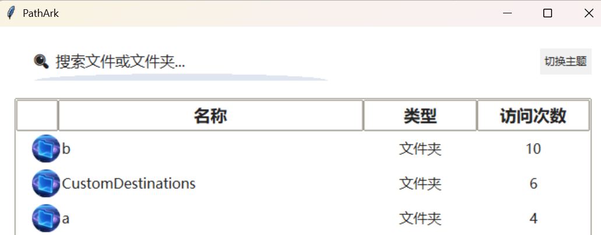

# PathArk

**你的文件/文件夹“任意门”！一秒直达，效率爆表！**

[English Version](./README_en.md)

## PathArk 是什么？

还在为找不到刚用过的文件而抓狂？还在桌面、资源管理器里翻来翻去？PathArk 让你彻底告别“翻箱倒柜”！它是 Windows 下的文件/文件夹快速访问神器，帮你把常用、最近用的文件/文件夹一网打尽，随时召唤，秒速直达！

## 主要功能

- 🚀 **自动收集最近访问**：自动更新最频繁访问的100个文件和文件夹，帮你记住每一次打开。双击某目录或者文件即可快速跳转到该目录或者打开此文件。
- 🏆 **访问次数排行**：常用的永远在前面，越用越懂你。
- 🔍 **智能搜索**：名字模糊也能搜，想找啥就搜啥。
- 🖱️ **双击即开**：不用右键、不用菜单，双击就能飞。
- 🎨 **炫酷圆形图标**：每一项都配专属小圆标，赏心悦目。
- 🌗 **一键切换黑白主题**：白天黑夜都护眼，风格随心换。
- 🛎️ **系统托盘驻留**：窗口关了也不怕，随时从托盘召唤主界面。

## 适合谁用？

- 文件/文件夹重度用户
- 办公党、设计师、程序员、学生……
- 觉得 Windows “最近使用”太鸡肋的你
- 喜欢高效、讨厌繁琐的你

## 怎么用？

1. 运行 `main.py`，主界面自动弹出。
2. 搜索、双击、切换主题，随你玩。
3. 关掉窗口也不怕，托盘图标随时召唤。
4. 右键托盘图标可彻底退出。

---

> **PathArk —— 让你的常用文件/文件夹像“任意门”一样，随叫随到！再也不用翻半天，效率提升不是一点点！**
> **未经授权，禁止用于商业用途。
Unauthorized commercial use is prohibited.**
---
