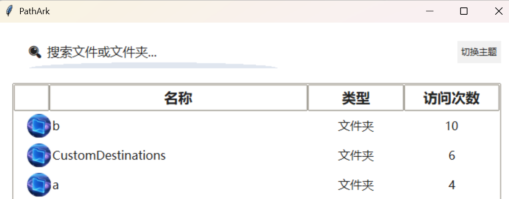
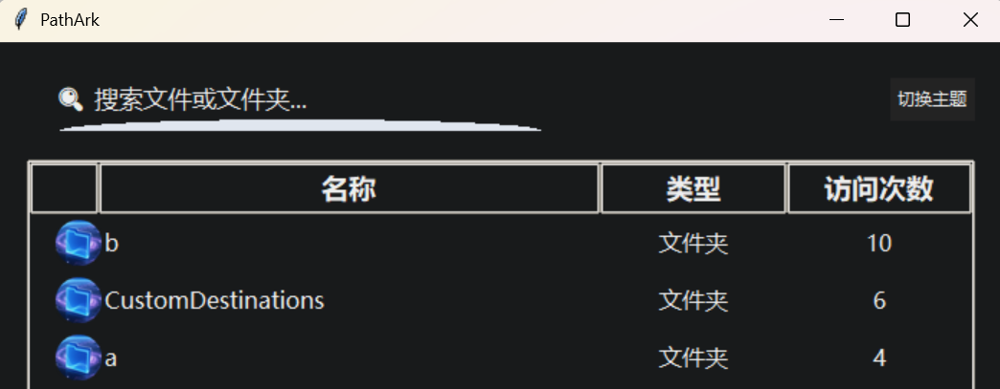

# PathArk

**Your “Anywhere Door” for files and folders! Instant access, efficiency skyrockets!**

[中文版请见顶部 | See the top for Chinese]

## What is PathArk?

Still frustrated about not finding the file you just used? Still searching back and forth on your desktop or in Explorer? PathArk puts an end to all that! It’s a lightning-fast file/folder launcher for Windows, collecting your frequently and recently used files/folders in one place—summon them anytime, reach them in a second!

## Main Features

- 🚀 **Auto-collect Recent Files**: Syncs with Windows Recent folder, remembers every file you open.
- 🏆 **Access Ranking**: Frequently used items always come first—the more you use, the smarter it gets.
- 🔍 **Smart Search**: Fuzzy name search—find anything, even if you only remember part of the name.
- 🖱️ **Double-click to Open**: No right-click, no menus—just double-click and go.
- 🎨 **Cool Circular Icons**: Every item has a unique round icon—pleasing to the eye.
- 🌗 **One-click Light/Dark Theme**: Protect your eyes day and night, switch styles as you wish.
- 🛎️ **System Tray Resident**: Window closed? No problem—summon the main interface anytime from the tray.

## Who is it for?

- Heavy file/folder users
- Office workers, designers, programmers, students…
- Anyone who finds Windows “Recent” too weak
- Efficiency lovers who hate complexity

## How to use?

1. Run `main.py` and the main interface pops up automatically.
2. Search, double-click, switch themes—do as you like.
3. Close the window? No worries, summon from the tray icon anytime.
4. Right-click the tray icon to exit completely.
5. If you find it useful, you are welcome to click star to support this project.
---

> **PathArk — Make your favorite files/folders as accessible as a magic door! No more endless searching, efficiency boosted by leaps and bounds!**
